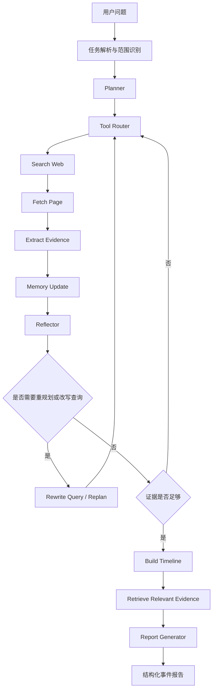

HotPulse Agent 是一个面向`热点事件追踪`的 `agentic intelligence search` 项目，当前主要作为受控单 Agent 形态的持续探索与能力抽象。

它重点展示以下能力：

- planning
- memory
- reflection 与 query rewrite
- tool selection
- orchestration loop
- grounded report generation
- lightweight evaluation

当前版本默认使用本地离线语料，便于稳定演示和回放。同时也已经支持通过环境变量切换到真实 `web search / page fetch` provider。
现在也支持通过项目级 JSON 配置文件集中管理 provider 与 API 信息。

## 项目结构

```text
hotpulse_agent/
  src/hotpulse_agent/
  src/hotpulse_agent/web/
  examples/corpus/
  examples/cases/
  evals/
  .runs/
```

## 执行流程



## 模块架构图

可编辑与可导出的图资产：

- Draw.io 源文件: [docs/diagrams/hotpulse_agent_architecture.drawio](docs/diagrams/hotpulse_agent_architecture.drawio)
- YAML 规格: [docs/diagrams/hotpulse_agent_architecture.spec.yaml](docs/diagrams/hotpulse_agent_architecture.spec.yaml)
- 元数据 sidecar: [docs/diagrams/hotpulse_agent_architecture.arch.json](docs/diagrams/hotpulse_agent_architecture.arch.json)
- SVG 预览: [docs/diagrams/hotpulse_agent_architecture.svg](docs/diagrams/hotpulse_agent_architecture.svg)


## Bridge Case 时序图

`bridge_accident` 执行轨迹对应的时序图资产：

- Mermaid 源文件: [docs/diagrams/bridge_case_sequence.mmd](docs/diagrams/bridge_case_sequence.mmd)
- Draw.io 源文件: [docs/diagrams/bridge_case_sequence.drawio](docs/diagrams/bridge_case_sequence.drawio)
- YAML sidecar: [docs/diagrams/bridge_case_sequence.spec.yaml](docs/diagrams/bridge_case_sequence.spec.yaml)
- 元数据 sidecar: [docs/diagrams/bridge_case_sequence.arch.json](docs/diagrams/bridge_case_sequence.arch.json)
- SVG 预览: [docs/diagrams/bridge_case_sequence.svg](docs/diagrams/bridge_case_sequence.svg)


## 模块技术栈

| 模块 | 当前实现 | 使用方法 | 后续可升级方向 |
| --- | --- | --- | --- |
| `planner` | [planner.py](src/hotpulse_agent/planner.py) | 规则式结构化任务拆解，输出 `sub_tasks / stop_conditions / open_questions` | 替换为 LLM planner 或 plan-and-execute policy |
| `memory` | [memory.py](src/hotpulse_agent/memory.py) | 分层 memory：`working / evidence / entity / reflection / timeline` | 增加向量库、图记忆或长期用户记忆 |
| `memory retrieval` | [memory.py](src/hotpulse_agent/memory.py) | 在 `claim + title + source` 上做 lexical overlap 检索，并结合 source reliability 打分 | 升级为 embedding retrieval + reranker |
| `search` | [search.py](src/hotpulse_agent/tools/search.py) | 本地 lexical retrieval，或接 `Tavily / SerpApi` | 增加 freshness rerank、domain weighting、hybrid retrieval |
| `fetch` | [fetch.py](src/hotpulse_agent/tools/fetch.py) | `local / Firecrawl / plain HTTP` 适配器 | 增加浏览器渲染、反爬处理 |
| `evidence extraction` | [extract.py](src/hotpulse_agent/tools/extract.py) | 离线语料直接用预标注 claims；真实网页回退到句子级 claim 抽取 | 升级为 LLM 抽取或信息抽取模型 |
| `reflector` | [reflector.py](src/hotpulse_agent/reflector.py) | 根据 evidence 数量、source diversity、冲突和搜索饱和度做规则反思 | 升级为 learned reflection policy 或 critic model |
| `query rewrite` | [reflector.py](src/hotpulse_agent/reflector.py) | 基于原 query、top entities、冲突主题、失败信号做启发式扩展 | 升级为 LLM query rewrite 或 query expansion model |
| `tool routing` | [router.py](src/hotpulse_agent/router.py) | 显式状态机 + policy gate | 升级为 LLM router + 程序策略约束 |
| `orchestrator` | [orchestrator.py](src/hotpulse_agent/orchestrator.py) | 显式状态机、受控 loop、budget 限制 | 增加 trace store、回放 harness、异步执行 |
| `timeline` | [timeline.py](src/hotpulse_agent/tools/timeline.py) | 按 `published_at` 排序并聚合同一时间锚点的事件 | 增加事件聚类与时间归一化 |
| `report generation` | [reporting.py](src/hotpulse_agent/reporting.py) | 基于 evidence memory 的模板式 grounded synthesis | 升级为带 citation constraint 的 LLM 报告生成 |
| `evaluation` | [run_eval.py](evals/run_eval.py) | 小型离线 case 集与过程指标 | 增加任务级 benchmark 和回归评测 |

## 关键技术选择

- `Planning`
  - 当前用结构化任务图，而不是自由文本推理。这样子任务状态、停止条件和 open questions 都可以显式观测。
- `Memory`
  - 当前按功能拆 memory，而不是一个大 buffer。`working memory` 管运行状态，`evidence memory` 管标准化证据，`entity memory` 支持 query rewrite，`reflection memory` 记录失败与修正理由。
- `Memory Retrieval`
  - 当前是轻量 lexical retrieval，不是向量检索。具体做法是对 `claim / title / source` 做词项重合匹配，再叠加 reliability 分数，等价于一个可控的 sparse baseline。
- `Search Retrieval`
  - 本地 fallback 用 token overlap + reliability 打分；真实模式可切到 `Tavily` 或 `SerpApi`，但不会改变 agent runtime 本身。
- `Reflection`
  - reflector 检查 evidence 是否足够、来源是否单一、是否有冲突、搜索是否饱和，然后决定是否 replan 或 rewrite query。
- `Query Rewrite`
  - 当前策略是启发式 query expansion，利用原问题、top entities、冲突主题、失败信号，以及 `official / investigation / conflict / verification` 这类扩展词。
- `Tool Selection`
  - 当前不是完全自由的 ReAct，而是显式状态机 + policy gate。这种方式更可控，也更适合面试里讨论安全性和可观测性。
- `Generation`
  - 最终报告不是直接基于原始网页 dump 生成，而是建立在 evidence memory 和 timeline 之上的 grounded synthesis。

## 快速开始

在 `hotpulse_agent` 目录下运行：

```bash
PYTHONPATH=src python3 -m hotpulse_agent.cli --case examples/cases/bridge_accident.json
```

如果要显式指定配置文件：

```bash
PYTHONPATH=src python3 -m hotpulse_agent.cli \
  --case examples/cases/bridge_accident.json \
  --config hotpulse.config.json
```

运行评测：

```bash
PYTHONPATH=src python3 evals/run_eval.py
```

## Web Demo

启动 Web Demo：

```bash
PYTHONPATH=src python3 -m hotpulse_agent.web.app
```

然后打开 `http://127.0.0.1:8000`。

当前页面支持：

- 输入热点词或事件追踪问题
- 切换 `online / offline` 模式
- 选择 search / fetch provider
- 显示当前 `rule / hybrid` policy 模式
- 展示结构化报告与时间线
- 展示 plan、trace、metrics 和 query history
- 在 `.runs/` 中保存本地运行历史

## HotPulse 专属评测设计

如果主要评的是 HotPulse 本身，而不是只评最终报告质量，那么评测要拆成模块级画像，而不是只给一个总分。

建议至少覆盖：

- `planning`
  - 看子任务拆解是否覆盖关键阶段、open questions 是否准确
- `memory`
  - 看 working / evidence / timeline / reflection 四层记忆是否记得住、取得准、不会污染后续决策
- `tool routing`
  - 看当前 state + memory snapshot 下是否选对工具，是否过早 timeline、过早 stop 或过度 search
- `reflection`
  - 看是否该补搜时补搜、该改写 query 时改写、该停时停，并评估 reflection 是否真正带来 coverage 增益
- `generation`
  - 看报告是否 grounded、是否正确表达不确定性、是否完整覆盖关键节点
- `runtime`
  - 看 budget、状态机迁移、失败恢复、循环控制是否稳定

更完整的工程做法是把评测做成独立 harness，而不是把逻辑散落在 runtime 里：

- `runtime`
  - 负责执行并输出 `AgentResult`
- `harness`
  - 负责加载 case、snapshot 回放、记录 step trace、运行 judge、聚合指标、输出回归报告

建议后续扩展方向：

- 增加 `offline_regression / snapshot_replay / online_backfill` 三类 case 集
- 增加 `planning_score / memory_score / routing_score / reflection_score / generation_score / runtime_score`
- 增加 failure taxonomy，例如 `memory_miss / bad_rewrite / wrong_tool_choice / premature_stop`

## 真实搜索 + 抓取模式

```bash
export HOTPULSE_SEARCH_PROVIDER=tavily
export TAVILY_API_KEY=tvly-...
export HOTPULSE_FETCH_PROVIDER=firecrawl
export FIRECRAWL_API_KEY=fc-...
PYTHONPATH=src python3 -m hotpulse_agent.cli --case examples/cases/bridge_accident.json
```

## 输出内容

CLI 会输出：

- plan
- step-by-step trace
- selected tools
- memory summary
- final structured report

## Bridge Case 说明

默认的 `bridge_accident` case 一般会走这条路径：

1. `planner` 生成 scope、updates、conflict、timeline、report 五类子任务
2. `search_web` 搜索桥梁事故候选信息源
3. `fetch_page` 抓取当前最合适的未读文档
4. `extract_evidence` 把网页或离线文档转成结构化证据
5. `memory` 更新 evidence、entities、reflection notes 和 fetched docs
6. `reflector` 判断证据是否过少、来源是否过窄
7. 如果需要，则做 query rewrite 并继续搜索
8. 当 evidence coverage 足够后，构建 timeline 并生成最终报告

## 为什么先做离线模式

MVP 默认使用本地语料，而不是直接依赖外网工具，主要因为：

1. agent runtime 更容易稳定回放和解释
2. search / fetch / extract 接口可以先抽象清楚，后续再替换成真实 provider

## Provider 配置

搜索 provider：

- `HOTPULSE_SEARCH_PROVIDER=local`
- `HOTPULSE_SEARCH_PROVIDER=tavily`
- `HOTPULSE_SEARCH_PROVIDER=serpapi`

抓取 provider：

- `HOTPULSE_FETCH_PROVIDER=local`
- `HOTPULSE_FETCH_PROVIDER=firecrawl`
- `HOTPULSE_FETCH_PROVIDER=http`

需要的 API key：

- `TAVILY_API_KEY`
- `SERPAPI_API_KEY`
- `FIRECRAWL_API_KEY`

也可以把这些配置统一放到项目级配置文件里：

- [hotpulse.config.example.json](hotpulse.config.example.json)

推荐做法：

1. 复制 `hotpulse.config.example.json` 为 `hotpulse.config.json`
2. 在其中填写 provider 与 API key
3. 直接运行 CLI，或通过 `--config` 指定配置文件路径

Policy 配置说明：

- `policy.mode=rule`
  - 完全走规则版 planner、router 和 reflector
- `policy.mode=hybrid`
  - LLM 优先决策，失败时自动 fallback 到规则版 planner / router / reflector
- `policy.mode=llm`
  - 强制优先走 LLM policy，但响应不合法时仍会回退

LLM policy 的配置方式有三种，按优先级从高到低分别是：

- `hotpulse.config.json` 里的 `policy.base_url / policy.api_key / policy.model`
- 环境变量 `HOTPULSE_LLM_BASE_URL / HOTPULSE_LLM_API_KEY / HOTPULSE_LLM_MODEL`
- OpenAI 兼容回退环境变量 `OPENAI_BASE_URL / OPENAI_API_KEY / OPENAI_MODEL`

示例：

```json
{
  "policy": {
    "mode": "hybrid",
    "base_url": "https://your-openai-compatible-endpoint/v1",
    "api_key": "sk-***",
    "model": "gpt-4.1-mini",
    "timeout": 20,
    "temperature": 0.1
  }
}
```

注意：

- `base_url` 应该配置到 OpenAI-compatible 的 `v1` 根路径，运行时会自动补 `/chat/completions`
- `api_key`、`base_url`、`model` 三项缺一不可，否则 `hybrid / llm` 仍会回退到规则链路
- 如果你当前 shell 里已经有 `OPENAI_API_KEY` 和 `OPENAI_BASE_URL`，但还是没有走到 LLM policy，最常见原因就是缺少 `OPENAI_MODEL`

## 在线验证结果

已在 2026 年 5 月 18 日完成一次真实在线验证，配置为：

- `search=tavily`
- `fetch=firecrawl`
- `policy.mode=hybrid`
- OpenAI-compatible `chat/completions` policy endpoint

验证结果：

- 运行状态达到 `FINAL_STATE=DONE`
- `plan_source=llm`
- `router_decision_sources` 全程为 `llm`
- `reflector_decision_sources` 全程为 `llm`
- 执行链路已经从单纯搜索推进到 `fetch_page` 和 `extract_evidence`
- 最终收集到 `6` 条 evidence，覆盖 `2` 个不同来源

这次在线验证中也暴露了两个更接近生产的问题，并已修复：

- Tavily 会拒绝过长的 LLM rewrite query；现在 [search.py](src/hotpulse_agent/tools/search.py) 会先把超长布尔检索式压缩后再发给 provider
- 当系统已经拿到未读候选文档时，LLM reflector 仍可能继续改写 query；现在 [reflector.py](src/hotpulse_agent/reflector.py) 会在应先抓取或抽取时阻断 rewrite

当前还保留一个真实线上特征：

- 某些站点的抓取时延较高；一次观测中 `fetch_page` 大约用了 `60s`，随后走了 `original-doc-fallback`，另一次则直接通过 `firecrawl` 在约 `8s` 内返回

## 文档

- 面试展示页: [showcase/index.html](showcase/index.html)
- 英文设计文档: [../docs/superpowers/specs/2026-05-16-hotpulse-agent-design.md](../docs/superpowers/specs/2026-05-16-hotpulse-agent-design.md)
- 中文设计文档: [../docs/superpowers/specs/2026-05-16-hotpulse-agent-design-zh.md](../docs/superpowers/specs/2026-05-16-hotpulse-agent-design-zh.md)
- 中文面试讲稿: [docs/hotpulse_agent_interview_talk_zh.md](docs/hotpulse_agent_interview_talk_zh.md)

## 后续可扩展方向

- 接更强的 web search / browser provider
- 用 LLM 替换规则版 planner / reflector / router
- 增加 trace viewer 或 Web demo
- 增加 source credibility calibration
- 增加 benchmark harness 与回归评测